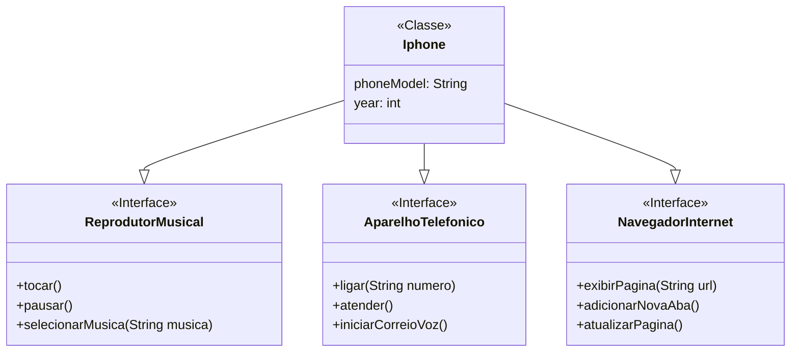

<h1> Modelagem e diagramação de um diagrama UML de um Iphone e suas funcionalidades: </h1>

```mermaid

classDiagram
direction TB
    class Iphone {
	    phoneModel: String
	    year: int
    }

    class ReprodutorMusical {
	    +tocar()
	    +pausar()
	    +selecionarMusica(String musica)
    }

    class AparelhoTelefonico {
	    +ligar(String numero)
	    +atender()
	    +iniciarCorreioVoz()
    }

    class NavegadorInternet {
	    +exibirPagina(String url)
	    +adicionarNovaAba()
	    +atualizarPagina()
    }

	<<Classe>> Iphone
	<<Interface>> ReprodutorMusical
	<<Interface>> AparelhoTelefonico
	<<Interface>> NavegadorInternet

    Iphone --|> ReprodutorMusical
    Iphone --|> AparelhoTelefonico
    Iphone --|> NavegadorInternet

```
